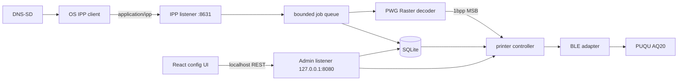

# PUQU AQ20 IPP 重构计划

## 结论

项目转型为跨平台 **IPP-to-BLE bridge / virtual printer daemon**：Windows、macOS、Linux 使用系统 IPP 客户端，本项目负责 IPP、DNS-SD、队列、PWG Raster、PUQU 协议和 BLE。

React 保留，但用途收缩为本机配置后台，不再提供标签编辑器。SQLite 成为服务端唯一持久化来源；浏览器 `localStorage` 不再保存设备或打印设置。

这不是内核驱动。目标是 IPP Everywhere 的 driverless 打印机：系统无需安装厂商驱动，只需后台 daemon 持续运行。

## Clean cutover 原则

不向后兼容。旧方向直接删除，不加 shim、alias、deprecated endpoint、旧配置导入器或双写逻辑。

必须删除：

- Fabric 编辑器、画布导出、二维码、条码、图片处理代码
- 原 `/api/print` 位图协议、SSE、旧 SPA 编辑路由
- 旧 `localStorage` key 和迁移代码
- Gin、r3labs/sse、Fabric、qrcode、jsbarcode 等无用依赖
- Moon、Proto、pnpm workspace、旧 root package、Air 配置
- 旧二进制、旧命令名、旧 module path、旧环境变量和文档
- 只服务旧设计的测试、类型、注释、build tag、re-export 和死代码

SQLite 使用新 schema，不导入浏览器本地数据。每个阶段完成时做删除检查：没有调用者的代码立即删，不留“以后可能用”。

## 已确认的仓库方向

- Git remote：`git@github.com:imbytecat/puqu-aq20-ipp.git`
- Moon：仓库只有空 `.moon/`，已删除
- Proto：未发现配置或引用
- 工具链与任务：统一使用 `mise`
- 不再使用 Moon/Proto 管理 monorepo
- Go module 移到仓库根；React 放在 `web/`
- 保持单 Go 二进制：生产构建继续嵌入 React 静态资源

## 产品范围

首个可靠目标：

- IPP/2.0 over HTTP
- DNS-SD 自动发现
- PWG Raster
- 203 DPI / 8 dot/mm
- 单色、单面
- 一个当前生效的标签 profile
- BLE 设备扫描、选择、保存、自动连接和重连
- 有界打印队列、状态查询、取消、作业历史
- React 本机配置界面
- SQLite 持久化
- Windows、macOS、Linux 原生 IPP 客户端

首版不做：

- PDF 渲染：让系统 IPP 客户端生成 PWG Raster，避免 MuPDF/Ghostscript/CGO/外部进程
- 彩色、双面、装订等 AQ20 不支持的能力
- 云打印、账号系统、远程后台
- 自动重试处于 `processing` 状态时崩溃的作业：无法确认纸张是否已经打印，启动后标记 `aborted` 更安全
- AirPrint 宣称：先通过 IPP Everywhere；验证 URF/PDF 和 Apple TXT 属性后再开放 AirPrint subtype

## 目标目录

```text
.
├── cmd/puqu-ipp/
│   ├── main.go
│   ├── serve.go
│   ├── discover.go
│   ├── print_test.go
│   └── service.go
├── internal/
│   ├── ble/          # 保留：跨平台原生 BLE adapter
│   ├── puqu/         # 保留：PUQU 帧和状态解析
│   ├── printer/      # 改造：连接、重连、打印、取消
│   ├── raster/       # 新增：PWG Raster -> 1bpp MSB
│   ├── ipp/          # 新增：IPP 操作、属性、队列、HTTP handler
│   ├── admin/        # 新增：配置 REST handler
│   ├── store/        # 新增：SQLite、迁移、sqlc 生成代码
│   └── web/          # 生产构建嵌入 React dist
├── db/
│   ├── migrations/
│   ├── queries/
│   └── schema.sql
├── web/              # React 配置后台
├── go.mod
├── go.sum
├── sqlc.yaml
├── mise.toml
├── README.md
└── PLAN.md
```

不建立 `pkg/`、通用 repository、event bus、插件系统或 ORM model 层。当前只有一个硬件实现、一个数据库和一个 IPP 输出方向。

## 总体架构



IPP 和后台配置使用两个 listener：

- `:8631`：只提供 `/ipp/print`，允许局域网客户端打印
- `127.0.0.1:8080`：React 和 `/api/*`，默认仅本机可访问

不能把无认证配置后台直接暴露到 LAN。以后确有远程配置需求，再显式开启监听并加认证/TLS。

## 模块与 seam

### `internal/ble`

原样迁移。继续使用 `tinygo.org/x/bluetooth` 和各操作系统原生栈；Linux 特征属性补丁继续使用 `godbus/dbus`。

### `internal/puqu`

原样迁移。继续保持纯函数和字节精确测试。

### `internal/printer`

保留现有 `Link` seam 和 fake 测试，但重写运行时控制：

- `Print` 接收 `context.Context`
- `waitUntilIdle` 返回超时、断链和状态读取错误，不能继续吞错
- 取消当前作业时发送 `puqu.Cancel()`
- 从 SQLite 读取选中的 BLE 设备和 profile
- daemon 启动后自动连接；断线后有限退避重连
- 同一时间只允许一个物理打印流程
- 将连接、busy、错误状态提供给 IPP 和后台

### `internal/raster`

只暴露一个核心动作：把已验证的 PWG Raster 文档解码为一个或多个 `printer.Job`。

只实现我们声明支持的组合：

- PWG Raster
- 203 DPI
- 单页或逐页标签
- 1-bit/8-bit grayscale；需要时接受常见 RGB 输入
- 尺寸必须匹配当前 label profile
- 输出按行 byte padding、MSB-first、1=black

未知颜色空间、分辨率、压缩、超大页面或尺寸不匹配直接返回 IPP document/media error；不静默缩放。

文本、条码和线稿默认阈值二值化，避免抖动损坏边缘。照片标签确有需求后，再用 `dither/v2` 提供可选算法。

### `internal/ipp`

深模块：外部只构造、启动、关闭；内部隐藏 operation、attributes、作业状态和队列。

职责：

- 使用 `goipp` 解析/生成 IPP message
- 使用标准库 `net/http` 提供 `/ipp/print`
- 校验版本、URI、operation attributes、document format、media 和大小
- 有界 queue，单 worker 顺序打印
- 维护 job ID 和 `pending/processing/completed/canceled/aborted` 状态
- 将 BLE 离线、打印中、错误映射为标准 printer/job state
- 限制请求体、队列长度和页面尺寸
- 支持 `Print-Job`、`Validate-Job`、`Get-Printer-Attributes`、`Get-Jobs`、`Get-Job-Attributes`、`Cancel-Job`
- 随后按 IPP Everywhere 规范和 self-cert 结果补齐其他强制 operation/attribute

DNS-SD 广播放在同一模块，避免为唯一调用者再造浅层包。

### `internal/admin`

只处理本机配置与操作：

- `GET /api/status`
- `POST /api/bluetooth/scan`
- `PUT /api/printer`
- `POST /api/printer/connect`
- `POST /api/printer/test`
- label profile CRUD 与激活
- IPP 名称、监听、DNS-SD 开关
- 最近作业和错误

不接收任意位图打印；正式打印只走 IPP。测试打印由服务端生成固定测试图案。

### `internal/store`

对上层暴露语义化方法，不泄露 SQL 字符串。内部使用 `database/sql`、sqlc 生成代码和 goose migration。

SQLite 只保存配置和作业元数据，不把 PWG Raster 大块长期塞进数据库。

## SQLite 方案

推荐组合：

- Driver：`github.com/ncruces/go-sqlite3/driver`
- Query generation：`sqlc`
- Migration：`github.com/pressly/goose/v3` + `//go:embed`
- Runtime interface：标准库 `database/sql`

选择 `ncruces/go-sqlite3`：

- 无 CGO，适合单二进制和多平台发布
- `database/sql` 兼容
- 直接依赖只有 Go 和 `x/sys`
- 上游持续测试 Linux/macOS/Windows 多架构
- 基于 wasm2go，每个连接内存高于原生 SQLite；本项目低并发、单小数据库，代价可接受

不选 `mattn/go-sqlite3`：需要 CGO，增加跨平台构建和分发成本。

不首选 `modernc.org/sqlite`：同样无 CGO且成熟，但生成代码和依赖体积通常更重；若 ncruces 在某个平台出现兼容问题，可直接替换 driver，因为上层只依赖 `database/sql`。

使用 sqlc，而不是 GORM：

- schema 和 SQL 是真相
- 生成类型安全 Go 方法
- 无反射、无 ORM 隐式行为
- sqlc 是构建期工具，不增加运行时依赖
- SQLite 已被 sqlc 正式支持

使用 goose，而不是手写 `PRAGMA user_version` migration switch：配置和作业历史会演进，嵌入 SQL migration 能保持单二进制，同时避免自造迁移框架。

### 初始表

```sql
CREATE TABLE app_settings (
    id INTEGER PRIMARY KEY CHECK (id = 1),
    ipp_name TEXT NOT NULL,
    printer_uuid TEXT NOT NULL,
    ipp_listen TEXT NOT NULL,
    advertise INTEGER NOT NULL CHECK (advertise IN (0, 1)),
    updated_at INTEGER NOT NULL
) STRICT;

CREATE TABLE ble_devices (
    id INTEGER PRIMARY KEY,
    native_id TEXT NOT NULL UNIQUE,
    name TEXT NOT NULL,
    address TEXT NOT NULL,
    write_uuid TEXT NOT NULL,
    notify_uuid TEXT,
    selected INTEGER NOT NULL CHECK (selected IN (0, 1)),
    last_seen_at INTEGER NOT NULL,
    updated_at INTEGER NOT NULL
) STRICT;

CREATE TABLE label_profiles (
    id INTEGER PRIMARY KEY,
    name TEXT NOT NULL UNIQUE,
    width_um INTEGER NOT NULL CHECK (width_um > 0),
    height_um INTEGER NOT NULL CHECK (height_um > 0),
    gap_um INTEGER NOT NULL CHECK (gap_um >= 0),
    paper_type INTEGER NOT NULL CHECK (paper_type BETWEEN 1 AND 3),
    darkness INTEGER NOT NULL CHECK (darkness BETWEEN 0 AND 11),
    speed INTEGER NOT NULL CHECK (speed BETWEEN 0 AND 5),
    active INTEGER NOT NULL CHECK (active IN (0, 1)),
    created_at INTEGER NOT NULL,
    updated_at INTEGER NOT NULL
) STRICT;

CREATE TABLE print_jobs (
    id INTEGER PRIMARY KEY,
    ipp_job_id INTEGER NOT NULL UNIQUE,
    name TEXT NOT NULL,
    user_name TEXT NOT NULL,
    state TEXT NOT NULL,
    document_format TEXT NOT NULL,
    copies INTEGER NOT NULL,
    bytes INTEGER NOT NULL,
    error TEXT,
    created_at INTEGER NOT NULL,
    started_at INTEGER,
    completed_at INTEGER
) STRICT;
```

约束：

- BLE 扫描结果是瞬时状态，只在用户选择/保存后写入数据库
- 只允许一个 selected device 和一个 active profile；更新时使用事务
- 时间统一存 UTC Unix milliseconds
- 启动时执行 embedded migrations；migration 失败则停止服务，不自动清库
- 启用 foreign keys、busy timeout；保持很小的连接池
- 启动时把遗留 `processing` 作业标记为 `aborted`，不自动重复打印
- 作业历史按数量或时间清理，例如保留最近 500 条；原始 document 不长期保存

## React 配置界面

保留：

- React 19
- Vite 8
- Tailwind 4
- TanStack Query：后台状态、轮询和 mutation
- TanStack Router：配置页、作业页、诊断页
- lucide-react

删除：

- Fabric.js
- qrcode
- jsbarcode
- 编辑器、画布、元素 inspector、前端 raster 导出
- `localStorage` 配置状态
- SSE 依赖；后台低频状态用 TanStack Query polling 足够

页面：

1. **Overview**：IPP URI、DNS-SD、BLE、打印机、队列状态
2. **Printer**：扫描 BLE、选择设备、连接、GATT 诊断、测试打印
3. **Labels**：profile 新建/编辑/激活；宽高、间隙、纸型、浓度、速度
4. **Jobs**：最近作业、状态、错误、取消 queued job
5. **System**：IPP 名称、监听端口、广播开关、数据库路径、版本

浏览器只显示和修改服务端状态；SQLite 是唯一 source of truth。

## 第三方库决策

| 用途 | 选择 | 决策 |
|---|---|---|
| BLE | `tinygo.org/x/bluetooth` | 保留，已有真实 AQ20 验证 |
| Linux GATT 属性 | `github.com/godbus/dbus/v5` | 保留，仅 Linux 补齐 tinygo 特征标志 |
| CLI | `github.com/spf13/cobra` | 保留，命令树已有价值 |
| IPP codec | `github.com/OpenPrinting/goipp` | 新增，纯 Go、BSD-2-Clause，不重写 RFC 8010 codec |
| HTTP | 标准库 `net/http` | 删除 Gin；Go 1.22+ ServeMux 足够处理 admin 和 IPP 两个 server |
| DNS-SD | `github.com/brutella/dnssd` | 新增，纯 Go、MIT，记录通过 Apple Bonjour mDNS conformance tests |
| SQLite | `github.com/ncruces/go-sqlite3/driver` | 新增，无 CGO、database/sql 兼容、跨平台测试完整 |
| SQL 生成 | `sqlc` | 新增为 mise 构建工具，不是运行时依赖 |
| Migration | `github.com/pressly/goose/v3` | 新增，SQL migrations 嵌入单二进制 |
| 后台服务 | `github.com/kardianos/service` | 包装阶段引入；先验证 BLE 权限和用户会话 |
| 抖动 | `github.com/makeworld-the-better-one/dither/v2` | 照片需求出现时再引入 |
| 日志 | 标准库 `log/slog` | 不新增日志框架 |
| 前端服务状态 | TanStack Query | 保留 |

拒绝 `grandcat/zeroconf`：上游 README 明确说明标准支持不完整、Bonjour 未测试；最终仍以 PWG `dnssd-tests` 为准。

拒绝 CUPS/libcups、Ghostscript、Poppler、MuPDF 作为运行时依赖：会引入 CGO、平台安装要求或额外进程，破坏单二进制目标。

目前未找到成熟、活跃、纯 Go 的 PWG Raster decoder。自实现严格的最小 decoder，比绑定 CUPS C API 更小、更可控。

## mise 方案

mise 继续统一 Go、Node、pnpm、sqlc 和任务；没有 Moon/Proto，也不需要 pnpm workspace。

```toml
[tools]
go = "1.26"
node = "24"
pnpm = "10"
sqlc = "1.31"

[tasks.dev]
depends = ["web:dev", "server:dev"]

[tasks."web:dev"]
dir = "web"
run = "pnpm dev"

[tasks."web:build"]
dir = "web"
run = "pnpm build"

[tasks."web:typecheck"]
dir = "web"
run = "pnpm typecheck"

[tasks."db:generate"]
run = "sqlc generate"

[tasks."server:dev"]
run = "go run ./cmd/puqu-ipp serve"

[tasks.build]
depends = ["web:build", "db:generate"]
run = "go build -tags embed -trimpath -o bin/puqu-ipp ./cmd/puqu-ipp"

[tasks.test]
run = "go test ./..."

[tasks.vet]
run = "go vet ./..."

[tasks.format]
run = "gofmt -w ."

[tasks.ci]
depends = ["build", "test", "vet", "web:typecheck"]
```

具体 sqlc 的 mise backend/version 在实施时按 registry 可用项锁定；如果没有 core registry 条目，使用 mise 的 aqua backend。不要退回 Proto。

## 实施阶段

### 阶段 0：干净切换

- 将 `apps/server` 移到根 Go module
- module path 改为 `github.com/imbytecat/puqu-aq20-ipp`
- 命令和二进制改名 `puqu-ipp`
- 将 `apps/web` 移到 `web`
- 删除编辑器相关前端代码和依赖
- 删除 `internal/api`，重新建立最小 admin API
- 保留并调整 build-tag gated React embed
- 删除 pnpm workspace/root package、Air 配置和旧构建产物
- 重写 mise、README、AGENTS
- 清理 Gin、SSE、Fabric、二维码和条码依赖
- 搜索并删除全部旧调用者、测试、类型、注释和 re-export

验收：一个根 Go module + 一个 React 子目录；无 Moon/Proto/workspace；无旧兼容层和死代码；`mise run build/test/vet/web:typecheck` 通过。

### 阶段 1：SQLite 与配置后台

- 集成 ncruces SQLite driver
- embedded goose migrations
- sqlc schema、queries 和生成任务
- React 改成配置后台
- BLE 扫描、设备选择、profile 和系统设置全部写 SQLite
- admin listener 仅绑定 localhost

验收：重启进程后设备/profile/IPP 设置仍存在；数据库迁移可从空库完成；浏览器不再使用 localStorage。

### 阶段 2：无编辑器的硬件 daemon

- `printer` 支持 context、错误传播和取消
- 启动自动连接、断线重连、状态快照
- 服务端固定测试图案
- 保留现有 PUQU/ble/printer 硬件无关测试

验收：配置页面完成 `scan -> save -> connect -> test print`；真实 AQ20 断线后能恢复。

### 阶段 3：PWG Raster 到 PUQU 位图

- 实现同步字、page header、支持的压缩和 scanline 解码
- 严格限制分辨率、尺寸、颜色空间和最大输入
- 单色 pack、必要的 grayscale/RGB 转换
- 使用官方/参考生成的最小 raster fixtures 做字节级测试

验收：fixture 产生预期 1bpp bytes；错误格式稳定拒绝；真实打印方向、尺寸和黑白极性正确。

### 阶段 4：IPP 核心和作业队列

- 集成 `goipp` + `net/http`
- 实现核心 operation、printer attributes、job attributes
- 有界队列、状态、取消、SQLite 作业元数据
- 使用 fake printer 做 handler 到 bitmap job 的端到端测试

验收：`ipptool` 能查询、提交、查询状态和取消；并发提交不会交叉 BLE 数据；后台能看到作业历史。

### 阶段 5：DNS-SD 和系统发现

- 用 `brutella/dnssd` 广播 `_ipp._tcp`
- 发布 `rp`、`pdl`、`UUID`、`ty`、`product` 等 TXT 属性
- IPP URI、SRV port、TXT 和 handler 使用同一份配置
- 处理名称冲突和网络接口变化

验收：Linux CUPS、macOS、Windows IPP Class Driver 均能发现并提交测试标签。

### 阶段 6：IPP Everywhere 合规

- 根据 PWG 5100.14 v1.1 补齐强制 operation、attribute 和错误码
- 跑 `dnssd-tests`、`ipp-tests`、`document-tests`
- 修正 media、resolution、job state 和 document-format 行为
- 仅测试通过后声明兼容

验收：PWG self-cert 工具通过；Windows/macOS/Linux 实际应用各打印一张标签。

### 阶段 7：安装与发布

- 评估并集成 `kardianos/service`
- `install/uninstall/start/stop/status` CLI
- Linux systemd、Windows Service、macOS launchd 分别验证真实 BLE 权限
- GitHub Actions 原生平台构建 release artifacts

验收：重启系统后 daemon 自动启动，IPP 打印机重新出现并可打印。若 system service 无法访问用户 BLE 权限，则改为用户级自启动，不伪装支持。

### 阶段 8：AirPrint 独立轨道

- 核实并实现 Apple 要求的 IPP/TXT 属性
- 选择实现 Apple Raster/URF 或安全 PDF 路径
- iPhone/iPad 真机通过后再广播 AirPrint universal subtype

## 主要风险

1. **PWG Raster parser**：无合适成熟纯 Go 库。限制支持矩阵，用官方工具生成 fixtures。
2. **系统兼容差异**：单元测试不够；每阶段用 `ipptool`，发现阶段再测 Windows/macOS/Linux。
3. **后台 BLE 权限**：service wrapper 不解决 macOS TCC 或 Windows service-session 权限。
4. **标签介质语义**：固定 active profile，拒绝尺寸不匹配，不静默缩放。
5. **网络暴露**：IPP 可在 LAN；admin 默认 localhost，避免任何人修改 BLE 和打印配置。
6. **SQLite 崩溃语义**：不自动重试未知是否已打印的 processing job，避免重复出纸。

## 规范和上游来源

- [PWG IPP Everywhere](https://www.pwg.org/ipp/everywhere.html)
- [IPP Everywhere v1.1 / PWG 5100.14-2020](https://ftp.pwg.org/pub/pwg/candidates/cs-ippeve11-20200515-5100.14.pdf)
- [PWG Raster standards](https://www.pwg.org/standards.html)
- [IPP Encoding and Transport / RFC 8010](https://www.rfc-editor.org/rfc/rfc8010.html)
- [DNS-Based Service Discovery / RFC 6763](https://www.rfc-editor.org/rfc/rfc6763.html)
- [OpenPrinting/goipp](https://github.com/OpenPrinting/goipp)
- [brutella/dnssd](https://github.com/brutella/dnssd)
- [ncruces/go-sqlite3](https://github.com/ncruces/go-sqlite3)
- [sqlc SQLite tutorial](https://docs.sqlc.dev/en/stable/tutorials/getting-started-sqlite.html)
- [goose embedded migrations](https://pressly.github.io/goose/blog/2021/embed-sql-migrations/)
- [kardianos/service](https://github.com/kardianos/service)
- [PWG IPP Everywhere self-certification](https://www.pwg.org/ippeveselfcert/)
- [CUPS Raster format reference](https://openprinting.github.io/cups/doc/spec-raster.html)
